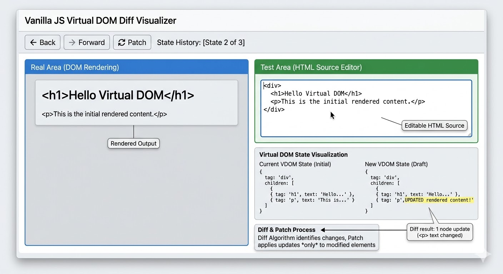

# \[WEEK04] 미니 리액트 만들기

## 요구 사항

* **React**의 핵심 개념인 **`Virtual DOM`**&#xACFC; **`Diff`** 알고리즘을 구현합니다.
  * 브라우저의 **`DOM`** 정보를 읽어서 **`Virtual DOM`**&#xC73C;로 변환하는 함수를 작성합니다.
  * 두 **`Virtual DOM`**&#xC744; 비교하여 변경된 부분을 찾아내는 **`Diff`** 알고리즘을 작성합니다.
* 이 알고리즘을 검증할 수 있는 웹 페이지를 구현합니다.
  * 페이지 내에 다음과 같이 2개의 영역과 **Patch, 뒤로가기, 앞으로가기** 버튼들이 있어야 합니다.
    * 실제 영역
    * 테스트 영역
  * 웹 페이지를 로드하면 
    * “실제 영역”의 샘플 HTML 코드를 **Virtual DOM** 트리로 변환합니다.
  * 방금 만든 **Virtual DOM**을 이용하여 테스트 영역을 렌더링합니다.
  * 사용자가 “테스트 영역”에 있는 샘플 HTML 코드를 자유롭게 수정합니다.
  * **`Patch`** 버튼을 누르면
    * 현재 테스트 영역 상태를 다시 **`Virtual DOM`**&#xC73C;로 만듭니다. 
    * **`Diff`** 알고리즘을 이용해서 이전 **`Virtual DOM`**&#xACFC; 비교하여 변경된 부분을 찾습니다. 
    * 변경된 부분만 “실제 영역”에 렌더링합니다. 
    * 새로 변경된 **`Virtual DOM`**&#xC740; State History에 저장합니다. 
  * **`뒤로가기`**, **`앞으로가기`** 버튼을 눌러 state history에 저장된 특&#xC815;**`Virtual DOM`** 으로 이동가능하며 “실제 영역”, “테스트 영역”도 함께 변경되어야 합니다. 
  * 기술 스택
    * HTML, CSS, Javascript(Vanilla)
* “학습” 보다는 “구현”이 우선입니다. AI 등을 적극적으로 활용하여 **결과물을 만들어내는 것**이 최우선 목표입니다. 다만, 만들어진 결과물 중 핵심 로직에 대해서는 이해하고 설명할 수 있어야 합니다.

***

Clipped from https://jungle-lms.krafton.com/learning/75

### 코치님 추가 조언

* Virtual DOM을 이해하려면 DOM을 이해해야하는 등 순차적으로 밀도있게 이해해야 함
* 내용을 잘 읽어봤으면 좋겠음
  * 순서대로 중점적 내용이 있을 것
  * 이것들이 인터뷰 질문이자 방향성을 잡아주는 질문이므로, 답을 잘 할 수 있었으면 좋겠음
  * 구현보다는 개념 위주로 공부했으면 좋겠음!

* 구현이 어려울 것 같지는 않아서 > 컨셉을 최대한 우선적으로 이해할 수 있도록!!
* 배포는 없고
* 100% CSR이어야 함 (서버 X)
* Typescript여도 무방함

[React (Virtual DOM, Diff 알고리즘) ](assets://./workspace/31df2dba-e405-4785-8647-f5ef6f3da697/CQxRTCHLIWuinxeGQsz1m)

***

* AI 한테 만든 알고리즘 주석 달아달라하기!
* Diff 알고리즘의 5요소 아래가 맞는지 확인
  1. **Old 노드와 New 노드가 둘 다 없으면?**→ 할 일 없음.
  2. **Old는 있는데 New가 없으면?**→ 실제 DOM에서 삭제 (`removeChild`).
  3. **Old는 없는데 New가 생겼으면?**→ 실제 DOM에 추가 (`appendChild`).
  4. **둘 다 있는데 태그 이름이 다르면?**→ 교체 (`replaceChild`).
  5. **태그 이름이 같으면?**
     * `Reflect`등을 사용해 **속성(props)**&#xC744; 비교해서 다른 부분만 업데이트.
     * **자식(children)**&#xB4E4;을 반복문 돌리며 다시 1번부터 재귀적으로 비교.

## 구현 필요 부분

| **단계**           | **핵심 구현 포인트**                                              | **담당자** |
| ---------------- | ---------------------------------------------------------- | ------- |
| 1. VDOM 생성       | HTML 문자열을 파싱하여 { type, props, children } 형태의 JS 객체로 변환     | @범진     |
| 3. Diff 설계       | 노드 타입 변경 여부, 속성(Attribute) 변경 여부, 자식 노드 개수 변화 체크           | ---@동현  |
| 5. State History | 요구사항에 있는 '뒤로가기/앞으로가기'를 위해 VDOM 객체 배열을 스택으로 관리              | @범진     |
| 2. Key 관리        | 반복되는 요소(li, div 등)에 고유 ID를 부여해 이동/삭제 감지                    | @동현     |
| 4. Patch 수정      | setAttribute, textContent, replaceChild 등을 활용해 최소한의 DOM 조작 | @정연     |
| 6. 전체 UI 구현      |  '실제 영역', '테스트 영역', '버튼들'의 레이아웃 구성 및 이벤트 바인딩.              | @정연     |

### 👨‍💻 멤버 A: 데이터 아키텍트 (Data & Parser)

**"입력을 데이터로 바꾸고, 과거를 기억하는 역할"**

* **담당 업무**:
  * **1. VDOM 생성**: `textarea`에 입력된 HTML 문자열을 분석(Parsing)하여 JS 객체 트리로 변환하는 함수 제작.
  * **5. State History**: VDOM 객체들을 배열(Stack)로 관리하고, 뒤로가기/앞으로가기 시 해당 시점의 VDOM을 꺼내주는 로직 구현.
* **핵심 과제**: 브라우저의 `DOMParser`를 쓸 것인지, 정규식을 쓸 것인지 결정하고 **표준화된 VDOM 객체 구조**를 정의하여 팀원들에게 공유해야 합니다.

### 👨‍💻 멤버 B: 알고리즘 전문가 (Logic & Diff)

**"무엇이 변했는지 찾아내는 두뇌 역할"**

* **담당 업무**:
  * **3. Diff 알고리즘 설계**: 이전 VDOM과 현재 VDOM을 재귀적으로 탐색하며 '변경 사항(Patch)' 리스트를 생성.
  * **2. Key 관리**: 노드 비교 시 `key` 값을 대조하여 노드가 이동했는지, 삭제되었는지 판단하는 로직 추가.
* **핵심 과제**: 단순히 "다르다"가 아니라, **"속성이 변함", "태그가 바뀜", "자식이 추가됨"** 등 변경의 종류(Type)를 정의하여 멤버 C에게 전달해야 합니다.

### 👨‍💻 멤버 C: 렌더링 & UI 엔지니어 (Renderer & UI)

**"가장 효율적으로 화면을 바꾸고 전체 틀을 잡는 역할"**

* **담당 업무**:
  * **4. Patch 수정**: 멤버 B가 전달한 '변경 사항' 리스트를 받아, 실제 DOM에 `setAttribute`, `replaceChild` 등을 사용해 최소한으로 반영.
  * **전체 UI 구현**: '실제 영역', '테스트 영역', '버튼들'의 레이아웃 구성 및 이벤트 바인딩.
* **핵심 과제**: 초기 렌더링(전체 그리기)과 패치(부분 수정) 로직을 구분하여 구현하고, 실제 영역의 DOM 요소를 직접 조작하는 코드를 작성합니다.

1. 요구사항 명세 ⇒각 부분별 기능 및 알고리즘 주석 추가 필요 
2. 아키텍처 (기술스택, 구조, 등?)
3. 함수명 명세 (타입, 이름, 반환값 등)
4. 협업 룰 (업무 분장, 네이밍 규칙)
5. git workflow guide (커밋 메시지 룰 등)
   1. git 사용시 사이클을 여러번 돌려보아라 (PR > branch > merge 자주 등등)
   2. PR은 한국어로\~
   3. 브랜치 생성 규칙도 만들기
6. 테스트 규칙 (최종)
7. gitignore 추가
8. 깃헙 이슈
   1. 생성/작업할 기능
   2. 테스트했을 때 오류 발생한 부분
   3. 기타 등등

***

## Readme.md 넣을 것

1. diff 알고리즘 5개 수도코드 내지는 내용 일부 생략된 코드 스니펫
2. 성능 벤치마킹 (DOM과 비교)
3. DOM이 느린 이유
   > **Reflow**/ **Repaint** 관점
4. 브라우저에&#xC11C;**&#x20;DOM**을 다루는 방법(**Document**, **Window**)
5. 실제 **DOM**의 변화를 감지 하기 위한 브라우저 API
6. 나머지는 생각해보자\~

* 스택으로 히스토리 관리
* 히스토리 관리 아이디어
  * A/B 중 하나 선택 (효율성 좋은 것 중 하나로)
  1. 스택에서 포인터만 움직여서 확인 (앞/뒤 이동시 손실 X, 스택 하나로 구현 가능)
     1. 단, 중간에 새로운 값이 생기면 포인터 뒷쪽 히스토리는 어떡하지?
  2. **두 개의 스택을 사용해서 앞으로 가기 스택/뒤로 가기 스택으로 구현 (직관적이고, 중간에 새로운 값이 생기면 앞으로 가기 스택만 날리면 되니까 편함)**
     1. 단, 스택을 2개 사용해야해서 메모리 효율이 나쁠 수도...?

| 비교 항목    | a. 포인터 방식 (Single Stack)    | b. 두 개의 스택 (Double Stack)  |
| -------- | --------------------------- | -------------------------- |
| 구현 난이도   | 포인터 연산 및 배열 절단(Slice) 로직 필요 | push, pop만으로 해결되어 매우 직관적   |
| 새 페이지 방문 | 현재 포인터 이후의 데이터를 모두 삭제해야 함   | forwardStack을 비우기만 하면 됨    |
| 메모리 효율   | 배열 하나만 관리하므로 이론상 미세하게 우위    | 스택 2개지만 전체 요소 수는 같아 차이 미미함 |
| 직관성      | 현재 위치를 계산해야 하므로 실수 가능성 있음   | "뒤로 가기"와 "앞으로 가기"가 명확히 분리됨 |

